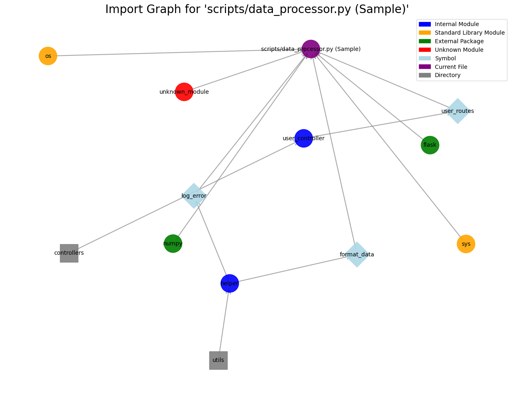

# Codegen_Challenge_Submission

A Python import visualization program.

> Running Program

- Upload the Jupyter Notebook to Colab.
- Start environment.
- Run all cells.

> Image

> Notes

- You can adjust the `DIRECTORY_PATH` variable to visualize different repositories.
- You can adjust the `FILE_NO` variable to visualize different files in the repository.
